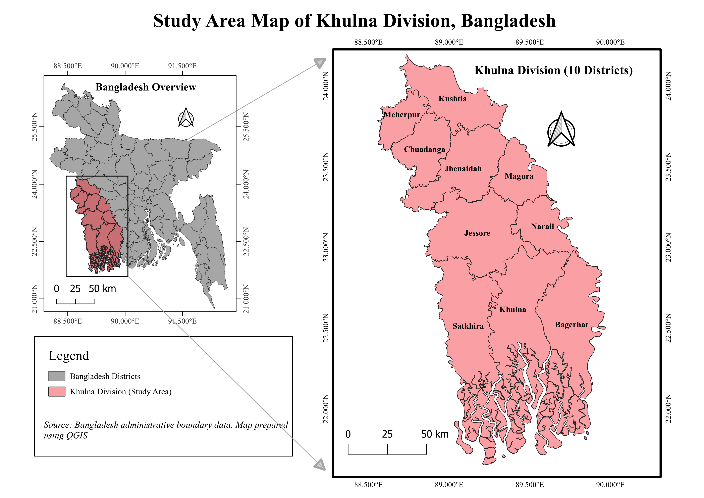
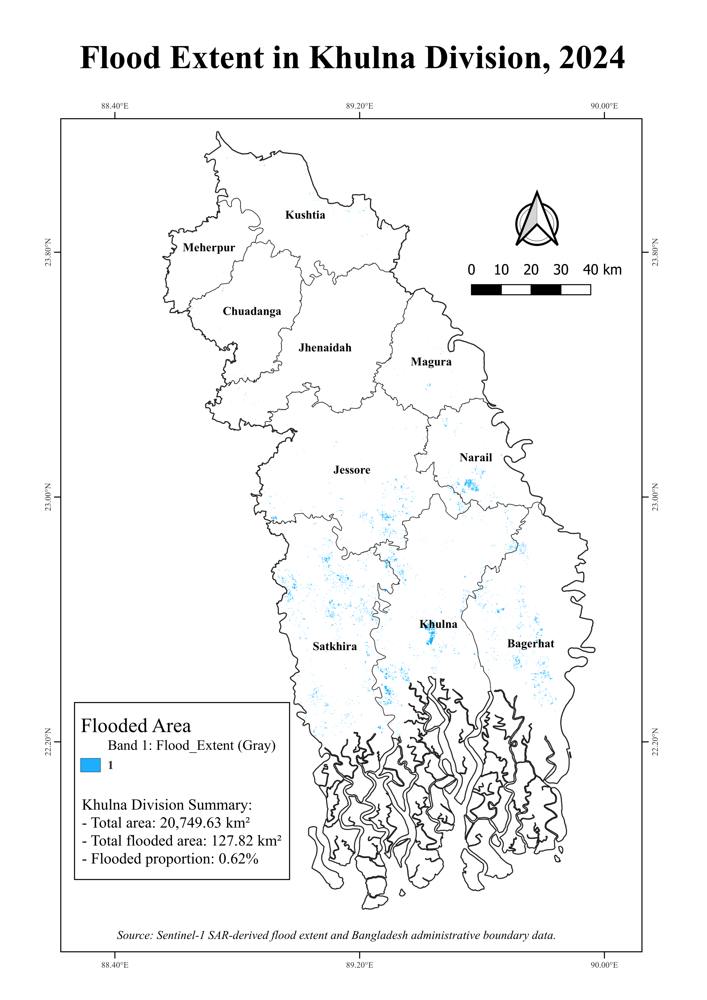
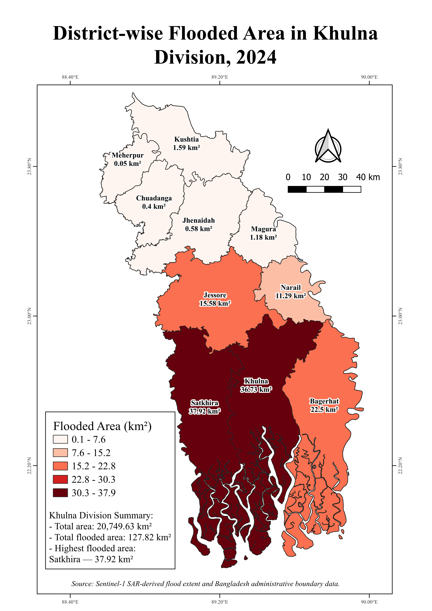
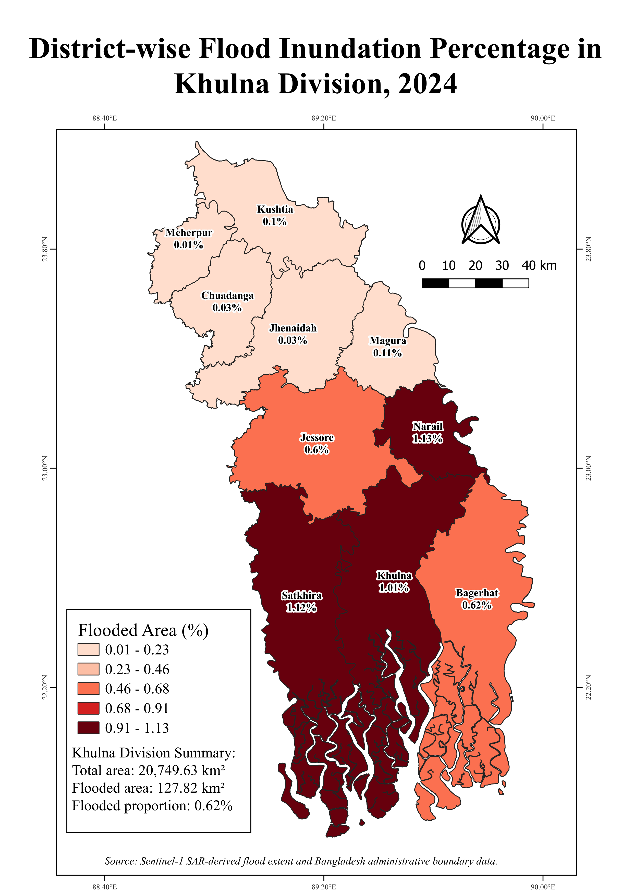
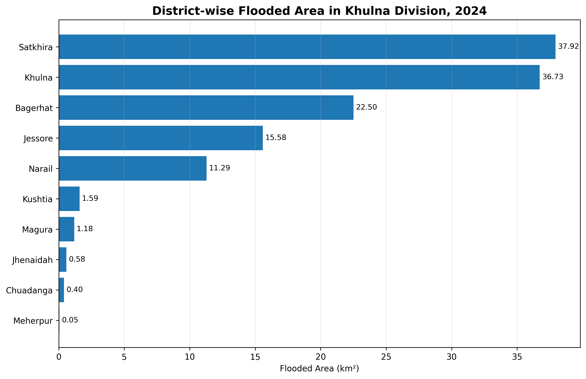
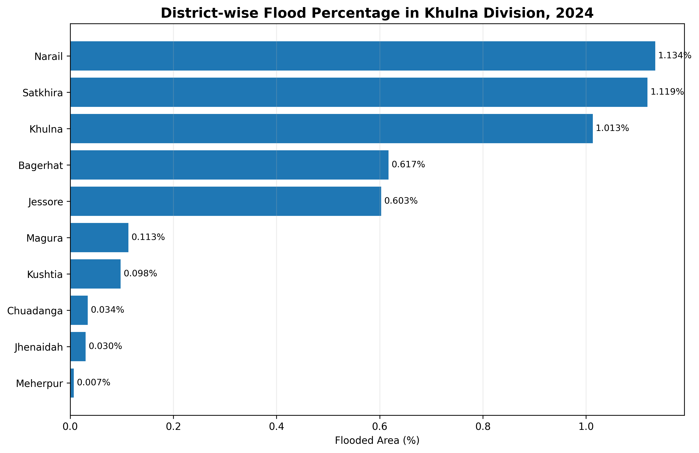

# Sentinel-1 Based Flood Mapping and District-wise Inundation Assessment of Khulna Division, Bangladesh (2024)

## Project Overview

This project presents a GIS- and remote-sensing-based flood mapping and district-level inundation assessment for **Khulna Division, Bangladesh**, using a binary **Sentinel-1 SAR-derived flood extent raster** for 2024.

The analysis focuses on identifying the spatial distribution of flooded areas, quantifying flood-affected area for each district, calculating district-wise flood percentage, and producing publication-quality maps, charts, and summary tables.

The workflow was completed mainly in **QGIS**, with the flood raster reprojected to a projected coordinate system for reliable area calculation.

---

## Objectives

The main objectives of this project are:

- To delineate the 2024 flood extent within Khulna Division.
- To calculate the total flood-affected area in square kilometres.
- To estimate district-wise flooded area using zonal statistics.
- To calculate the percentage of each district affected by flooding.
- To compare flood exposure among the 10 districts of Khulna Division.
- To prepare publication-quality maps, charts, and tabular outputs.
- To document the workflow in a reproducible GIS project structure.

---

## Study Area

The study area is **Khulna Division**, located in southwestern Bangladesh.

The analysis includes the following 10 districts:

- Bagerhat
- Chuadanga
- Jessore
- Jhenaidah
- Khulna
- Kushtia
- Magura
- Meherpur
- Narail
- Satkhira

The total mapped divisional area used in the analysis is approximately **20,749.63 km²**.

---

## Data Sources

| Dataset | Application |
|---|---|
| Sentinel-1 SAR-derived binary flood extent raster (2024) | Flood extent mapping and flood area calculation |
| Bangladesh administrative boundary data | Division and district boundary extraction |
| District-level polygon layer | Zonal statistics and district-wise comparison |

---

## Coordinate Reference Systems

Two coordinate reference systems were used during the workflow:

- **EPSG:4326 — WGS 84** for the original geographic datasets.
- **EPSG:32645 — WGS 84 / UTM Zone 45N** for area calculation and final spatial analysis.

The final flood raster had a spatial resolution of **30 m × 30 m**, corresponding to **900 m² per pixel**.

---

## Methodology

The overall workflow consisted of the following steps:

1. Preparation of the Bangladesh administrative boundary layer.
2. Selection of the 10 districts belonging to Khulna Division.
3. Export of selected districts as a separate vector layer.
4. Dissolving district polygons to create the Khulna Division boundary.
5. Clipping the 2024 flood raster using the Khulna Division boundary.
6. Reprojecting the clipped flood raster from EPSG:4326 to EPSG:32645.
7. Preserving the binary raster using nearest-neighbour resampling.
8. Calculating total flood pixels and total flood-affected area.
9. Reprojecting district boundaries to EPSG:32645.
10. Calculating district area in square kilometres.
11. Applying zonal statistics to calculate the number of flood pixels within each district.
12. Converting flood-pixel counts to flooded area (km²).
13. Calculating district-wise flood percentage.
14. Preparing thematic maps, charts, and the final results table.

### Flood Area Calculation

Each raster pixel represents:

`30 m × 30 m = 900 m² = 0.0009 km²`

Therefore:

`Flooded Area (km²) = Flood Pixel Count × 0.0009`

District-wise flood percentage was calculated as:

`Flooded Area (%) = (Flooded Area / District Area) × 100`

---

## Key Results

The total flood-affected area within Khulna Division was approximately:

**127.82 km²**

This represents approximately:

**0.62% of the total mapped divisional area**

### Major Findings

- **Satkhira** recorded the largest absolute flooded area: **37.92 km²**.
- **Khulna** recorded the second-largest flooded area: **36.73 km²**.
- **Bagerhat** recorded approximately **22.50 km²** of flooded area.
- **Narail** recorded the highest district-level flooded percentage: **1.134%**.
- **Satkhira** had the second-highest flooded percentage: **1.119%**.
- **Khulna** had approximately **1.013%** of its area classified as flooded.
- **Meherpur** recorded the lowest flood exposure: approximately **0.05 km²**, or **0.007%**.

---

## District-wise Flood Statistics

| District | Total Area (km²) | Flooded Area (km²) | Flooded Area (%) |
|---|---:|---:|---:|
| Bagerhat | 3646.18 | 22.50 | 0.617 |
| Chuadanga | 1165.10 | 0.40 | 0.034 |
| Jessore | 2584.93 | 15.58 | 0.603 |
| Jhenaidah | 1956.11 | 0.58 | 0.030 |
| Khulna | 3625.14 | 36.73 | 1.013 |
| Kushtia | 1614.73 | 1.59 | 0.098 |
| Magura | 1048.76 | 1.18 | 0.113 |
| Meherpur | 722.53 | 0.05 | 0.007 |
| Narail | 995.74 | 11.29 | 1.134 |
| Satkhira | 3390.40 | 37.92 | 1.119 |
| **Total / Overall** | **20,749.63** | **127.82** | **0.62** |

---

## Final Maps

### 1. Study Area Map



### 2. Flood Extent Map — 2024



### 3. District-wise Flooded Area



### 4. District-wise Flood Percentage



---

## Charts

### District-wise Flooded Area



### District-wise Flood Percentage



---

## Software and Tools Used

- QGIS
- GDAL processing tools
- Raster clipping and reprojection
- Vector selection and dissolve
- Field Calculator
- Zonal Statistics
- Raster Unique Values Report
- Microsoft Excel for result summarisation and charts

---

## Repository Structure

```text
Sentinel1-Flood-Mapping-Khulna-2024/
│
├── README.md
│
├── 01_QGIS_Project/
│   └── Khulna_Flood_Mapping_2024.qgz
│
├── 02_Final_Maps/
│   ├── Map_01_Study_Area_Khulna.png
│   ├── Map_02_Flood_Extent_2024.png
│   ├── Map_03_District_Flooded_Area_2024.png
│   └── Map_04_District_Flood_Percentage_2024.png
│
├── 03_Final_Results/
│   ├── Khulna_District_Flood_Statistics_2024.csv
│   └── Khulna_District_Flood_Statistics_2024.xlsx
│
├── 04_Charts/
│   ├── Chart_01_District_Flooded_Area_2024.png
│   └── Chart_02_District_Flood_Percentage_2024.png
│
└── 05_Documentation/
    └── workflow.png
```

---

## Final Outputs

The project provides:

- Study area map
- 2024 flood extent map
- District-wise flooded-area map
- District-wise flood-percentage map
- District-wise flooded-area comparison chart
- District-wise flood-percentage comparison chart
- Final CSV results table
- Final Excel results workbook
- Reproducible QGIS project

---

## Notes

Large raw Sentinel-1 raster datasets and temporary GIS processing files are not included in this repository. The repository focuses on final processed outputs, analysis results, cartographic products, and reproducible project documentation.

---

## Author

**Sujoy Biswas**

Civil Engineering  
Water Resources / GIS / Remote Sensing

GitHub: [sujoybiswas115](https://github.com/sujoybiswas115)
